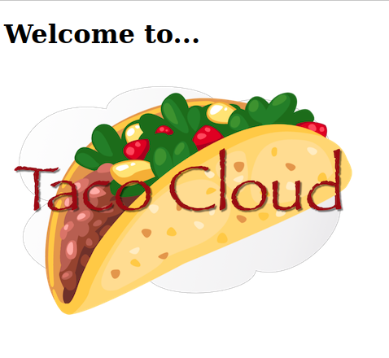

# TACO CLOUD
Учебный проект созданный в процессе прочтения книги Крейга Уоллеса "Spring в действии"
 

- ;

## Используемые технологии
 - Spring Boot 3.2.5
 - Thymeleaf
 - Spring Boot Devtools
 - Lombok
 - Spring Boot Starter Test
 - Spring Boot Starter Web
